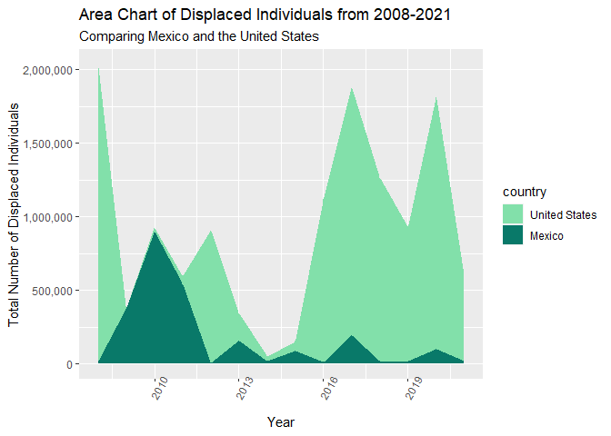
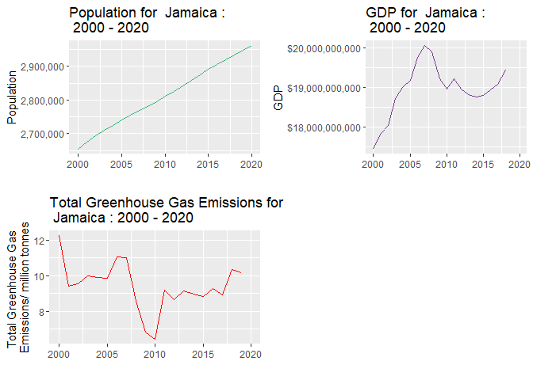

<!-- README.md is generated from README.Rmd. Please edit that file -->

# mpm 

<!-- badges: start -->

[](https://lifecycle.r-lib.org/articles/stages.html#experimental)
[](https://github.com/parunjodhi/mpm/actions/workflows/R-CMD-check.yaml)
<!-- [](https://CRAN.R-project.org/package=mpm) -->
<!-- badges: end -->

The goal of this package is to provide a centralized place to clearly
visualize the effects of climate change based on key demographics by
country. `mpm` is a package that contains data about various greenhouse
gas (GHG) emissions, air pollution metrics in terms of
Disability-Adjusted Life Years (DALYs) and internal displacement per
country based on GDP and population.

## Installation

You can install the development version of `mpm` like so:

``` r
devtools::install_github("parunjodhi/mpm")
```

Load `mpm` R package

``` r
library(mpm)
```

## Datasets Included

- `owid_ghg`: A dataset looking at CO2 and Greenhouse Gas (GHG)
  Emissions filtered for countries in North America.
- `air_data`: A dataset looking at air pollution in terms of DALYS
  filtered for countries in North America.
- `regional_grouping`: A dataset grouping North American countries into
  regions by economic class
- `displaced_by_disaster`: A dataset looking at internal displacement
  counts due to extreme events caused by climate change.

### Example: Air Pollution Data Measured in DALYS

``` r
head(air_data)
#> # A tibble: 6 × 5
#>   country              year air_pollution household_pollution outdoor_pollution
#>   <chr>               <dbl>         <dbl>               <dbl>             <dbl>
#> 1 Antigua and Barbuda  1990          643.                69.3              573.
#> 2 Antigua and Barbuda  1991          648.                64.5              582.
#> 3 Antigua and Barbuda  1992          657.                60.2              596.
#> 4 Antigua and Barbuda  1993          689.                58.1              629.
#> 5 Antigua and Barbuda  1994          695.                54.0              639.
#> 6 Antigua and Barbuda  1995          705.                50.6              652.
```

## Functions Included

- `population_plot`: Graphs population of a country over the years.
- `gdp_plot`: Graphs GDP of a country over the years.
- `ghg_plot`: Graphs GHG of a country over the years.
- `all_demographics`: Graphs separately population, GDP and GHG of a
  country over the years.
- `population_predict`: Predict the population for a country for a
  specific year.
- `gdp_predict`: Predict the GDP for a country for a specific year.
- `ghg_predict`: Predict the total GHG for a country for a specific
  year.
- `all_data_country`: Gather data from all data sets for a country.
- `dalys_predict`: Predict DALYS and total GHG for a country for a
  specific year.
- `displaced_histogram`: Distribution of people internally displaced in
  a country.
- `displaced_linegraph`: Graph of internal displacement counts over the
  years for a specific country.

## Basic Usage

These are a few examples of how to use the package and its functions to
wrangle and visualize data related to demographics and emissions in
countries in North America.

### Data Visualization functions

1.  Visualize the trend in internal displacement for Guatemala.

``` r
displaced_linegraph("Guatemala")
#> Warning in geom_line(fill = "#800000"): Ignoring unknown parameters: `fill`
```



2.  Visualize the trends in population, GDP and total GHG emissions for
    Jamaica from 2000 to 2020

``` r
all_demographics("Jamaica", min_year = 2000)
#> Warning: Removed 2 rows containing missing values (`geom_line()`).
#> Warning: Removed 1 row containing missing values (`geom_line()`).
```



### Prediction functions

1.  If all else stays constant, what would be the total DALYs and GHG
    emissions for the United States in 2030?

``` r
dalys_predict(2045)
#> Warning in dalys_predict(2045): This prediction is based off of a generalized
#> linear regression model, even if the data might not follow a linear pattern over
#> the years. This is for estimation purposes only.
#> [1] "The Total DALYs predicted for United States for the year 2045 is 281493 total years. Each person will suffer from an average loss in about 0.00072 years due to health issues that arose from air pollution. The Total Predicted GHG is 6025.917 million tonnes."
```

2.  If all else stays constant, what would be the GDP for Mexico in
    2045?

``` r
gdp_predict(2045, "Mexico")
#> Warning in gdp_predict(2045, "Mexico"): This prediction is based off of a linear
#> regression model, even if the data might not follow a linear pattern over the
#> years. This is for estimation purposes only.
#> [1] "The GDP predicted for Mexico for the year 2045 is US$2378532403840.4."
```

For more ways on how to use this package, its functions and datasets,
please refer to the
[vignette](https://github.com/parunjodhi/mpm/blob/main/vignettes/mpm.Rmd).

## Contributors

- [Mack Case](https://github.com/mcase07)
- [Michel Ruiz-Fuentes](https://github.com/michelruizfuentes)
- [Parunjodhi Munisamy](https://github.com/parunjodhi)
